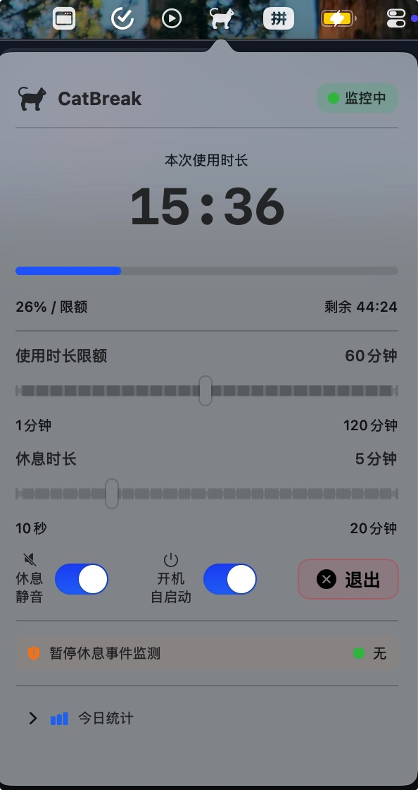
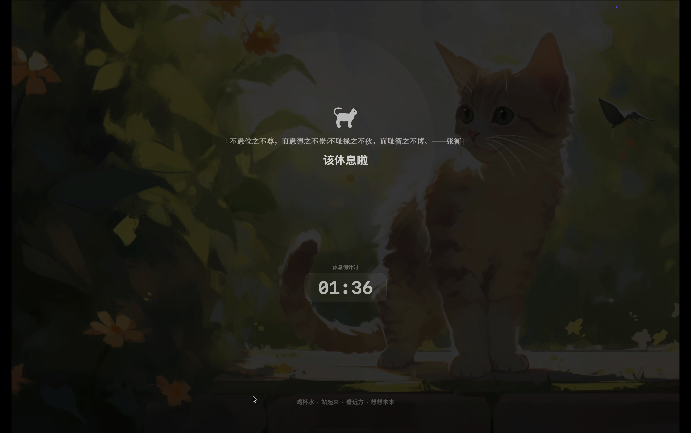

# CatBreak

<p align="center">
  
</p>

<p align="center">
  <strong>🐱 macOS 休息提醒工具 - 强制休息，保护视力</strong>
</p>

<p align="center">
  一款专为 macOS 设计的菜单栏工具，通过全屏覆盖休息提醒强制用户定时休息，防止长时间持续用眼和久坐。以猫咪为主题，提供沉浸式休息体验。
</p>

---

## ✨ 核心特性

- 🔒 **强制休息** - 全屏覆盖不可跳过，真正打断连续用眼
- 🧠 **智能感知** - 检测会议/通话等场景，推迟休息避免干扰工作
- 🐱 **猫咪陪伴** - 萌猫主题 + 名言警句，让休息更有趣
- 🎯 **零打扰** - 菜单栏常驻，不占 Dock，设置简洁

---

## 📸 界面预览

### 设置面板

<p align="center">
  
</p>

### 休息覆盖界面

<p align="center">
  
</p>

---

## 🚀 安装

### 下载安装

1. 从 [Releases](https://github.com/bbly-oneday/CatBreak/releases) 页面下载最新的 `CatBreak-vX.X.dmg` 文件
2. 打开 DMG 文件，将 `CatBreak.app` 拖入 Applications 文件夹
3. 首次运行可能需要在「系统偏好设置 → 安全性与隐私」中允许运行

### 系统要求

- macOS 13.0 (Ventura) 及以上
- 支持 Intel + Apple Silicon (Universal Binary)

---

## 📖 功能说明

### 使用时长计时

状态机逻辑：

```
              用户活跃
  ┌─────────┐  ───────>  ┌────────────┐  达到上限  ┌──────────┐
  │  idle   │            │ monitoring  │ ────────> │ breaking │
  │  待机   │ <───────  │   监控中    │           │  休息中  │
  └─────────┘  离开>10分 └────────────┘           └──────────┘
                      ↑        │                       │
                      │  离开>3分│                       │ 倒计时归零
                      │        ↓                       ↓
                      └── ┌──────────┐          ┌──────────┐
                          │  paused   │          │  idle    │
                          │  已离开    │          │  待机    │
                          └──────────┘          └──────────┘
```

- **idle (待机)**: 等待用户活动，不累计时间
- **monitoring (监控中)**: 每 1 秒滴答，累计使用时长
- **paused (已离开)**: 无输入超过 3 分钟，暂停计时
- **breaking (休息中)**: 全屏覆盖显示，倒计时休息时长

### 空闲检测规则

| 规则 | 阈值 | 行为 |
|------|------|------|
| 进入暂停 | 无鼠标/键盘输入 > 3 分钟 | 计时暂停 |
| 恢复监控 | 离开后 < 10 分钟恢复输入 | 从暂停时的时长继续计时 |
| 重置计时 | 离开 > 10 分钟 | 已用时长清零 |

### 敏感应用智能检测

默认预置 7 款应用：

| 应用 | Bundle ID |
|------|-----------|
| 腾讯会议 | com.tencent.meeting |
| Zoom | us.zoom.xos |
| Microsoft Teams | com.microsoft.teams |
| Chrome | com.google.Chrome |
| FaceTime | com.apple.FaceTime |
| QQ | com.tencent.MacQQ |
| 微信 | com.tencent.xinWeChat |

检测到会议/通话时：
- 自动推迟休息（最多 10 分钟）
- 设置面板显示橙色警告：「会议/视频中，推迟休息」
- 超过 10 分钟强制执行休息

---

## ⚙️ 设置选项

| 设置项 | 说明 | 默认值 |
|--------|------|--------|
| 使用时长上限 | 连续使用电脑的时间限制 | 60 分钟 |
| 休息时长 | 每次休息的持续时间 | 5 分钟 |
| 休息时静音 | 休息开始时自动静音 | 关闭 |
| 开机自启 | 登录时自动启动 | 关闭 |
| 敏感应用 | 会议/通话应用列表 | 7 个预置应用 |

---

## 🔒 隐私声明

- ❌ 无网络请求
- ❌ 无数据上报
- ❌ 无用户追踪
- ✅ 所有数据本地存储

---

## 🛠️ 技术栈

| 层面 | 技术选型 |
|------|----------|
| 语言 | Swift 5.9 |
| UI 框架 | SwiftUI + AppKit |
| 构建 | Xcode 15.0 + SPM |
| 最低系统 | macOS 13.0 |

---

## 📝 开发计划

- [ ] 添加音效支持
- [ ] 支持自定义名言警句
- [ ] 添加使用时长统计报表
- [ ] 支持键盘快捷键

---

## 📄 许可证

MIT License

---

## 🤝 贡献

欢迎提交 Issue 和 Pull Request！

---

<p align="center">
  Made with ❤️ for healthy eyes
</p>
