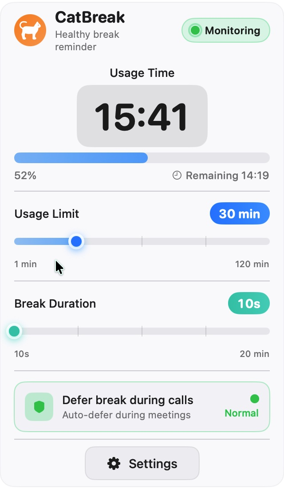
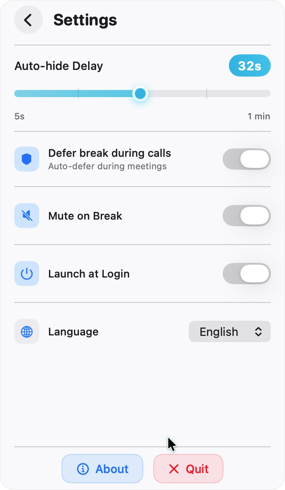

# CatBreak

<p align="center">
  
</p>

<p align="center">
  <strong>🐱 macOS Break Reminder - Enforce Rest, Protect Your Vision</strong>
</p>

<p align="center">
  A menu bar tool for macOS that enforces regular breaks through fullscreen overlays, preventing prolonged screen time and sedentary behavior. Cat-themed for a delightful break experience.
</p>

---

## ✨ Key Features

- 🔒 **Enforced Breaks** - Fullscreen overlay that cannot be skipped, truly interrupting continuous screen time
- 🧠 **Smart Detection** - Detects meetings/calls and automatically defers breaks to avoid disrupting work
- 🐱 **Cat Companion** - Cat theme + inspirational quotes to make breaks enjoyable
- 🌍 **Multi-Language** - Supports Chinese and English interfaces, switch anytime without restart
- 🎨 **Beautiful UI** - Modern design, adapts to dark/light mode
- 📊 **Smart Progress Bar** - Color deepens with progress, intuitive visual feedback
- ⏱️ **10-Second Warning** - Yellow countdown reminder when break is ending
- 🎯 **Zero Disturbance** - Lives in menu bar, no Dock icon, one-click operation

---

## 📸 Screenshots

### Main Panel

<p align="center">
  
</p>

### Settings Panel

<p align="center">
  
</p>

### Break Overlay

<p align="center">
  
</p>

---

## 🚀 Installation

### Download & Install

1. Download the latest `CatBreak-vX.X.dmg` from [Releases](https://github.com/bbly-oneday/CatBreak/releases)
2. Open the DMG file, drag `CatBreak.app` to Applications folder
3. On first run, you may need to allow it in "System Preferences → Security & Privacy"

### System Requirements

- macOS 13.0 (Ventura) or later
- Supports Intel + Apple Silicon (Universal Binary)

---

## 📖 How It Works

### Usage Timer State Machine

```
                  User Active
  ┌─────────┐  ───────>  ┌────────────┐  Limit Reached  ┌──────────┐
  │  idle   │            │ monitoring  │ ─────────────> │ breaking │
  │  Idle   │ <───────  │ Monitoring  │                │ Breaking │
  └─────────┘  Away>10m  └────────────┘                └──────────┘
                      ↑        │                             │
                      │ Away>3m│                             │ Countdown
                      │        ↓                             ↓ Complete
                      └── ┌──────────┐                ┌──────────┐
                          │  paused   │                │  idle    │
                          │  Paused   │                │  Idle    │
                          └──────────┘                └──────────┘
```

- **idle**: Waiting for user activity, not counting
- **monitoring**: Ticking every second, accumulating usage time
- **paused**: No input for 3+ minutes, timer paused
- **breaking**: Fullscreen overlay displayed, countdown break duration

### Idle Detection Rules

| Rule | Threshold | Behavior |
|------|-----------|----------|
| Enter Pause | No mouse/keyboard input > 3 minutes | Timer paused |
| Resume | Input detected within 10 minutes away | Continue from paused time |
| Reset | Away > 10 minutes | Usage time reset to zero |

### Smart Meeting/Call Detection

7 apps pre-configured by default:

| App | Bundle ID |
|------|-----------|
| Tencent Meeting | com.tencent.meeting |
| Zoom | us.zoom.xos |
| Microsoft Teams | com.microsoft.teams |
| Chrome | com.google.Chrome |
| FaceTime | com.apple.FaceTime |
| QQ | com.tencent.MacQQ |
| WeChat | com.tencent.xinWeChat |

When meeting/call detected:
- Automatically defer break (up to 10 minutes)
- Monitoring card shows "Deferred" status
- Force break after 10 minutes

### 10-Second Warning

When break is ending (10 seconds remaining):
- Countdown numbers turn yellow
- Title changes to "Ending Soon"
- Bottom hint: "Break ending soon, prepare to continue"
- Gentle reminder with natural color scheme

---

## ⚙️ Settings

| Setting | Description | Default |
|--------|-------------|---------|
| Usage Limit | Time limit before break (1-120 minutes) | 60 minutes |
| Break Duration | Duration of each break (10 seconds - 20 minutes) | 5 minutes |
| Language | Interface language (中文/English) | 中文 |
| Auto-hide Delay | Window auto-hide time (5-60 seconds) | 10 seconds |
| Mute on Break | Automatically mute when break starts | Off |
| Launch at Login | Automatically start on login | Off |

### Progress Bar Interaction

- **Click to Position**: Click anywhere on the progress bar to jump directly
- **Drag to Adjust**: Drag the slider for precise adjustment
- **Tick Marks**: 4 evenly distributed marks for quick positioning
- **Color Gradient**: Color deepens as value increases (natural color scheme)

---

## 🎨 UI Features

### Modern Design

- **Rounded Window**: 12px corner radius, matches macOS design language
- **Status Badge**: Rounded capsule + outer glow, status at a glance
- **Gradient Progress Bar**: Color deepens with progress, intuitive visual feedback
- **Gradient Button**: Quit button with gradient red, eye-catching and beautiful
- **Window Positioning**: Snaps to bottom of menu bar, centered on icon

### Dark/Light Mode

- Automatically adapts to system appearance
- Tailored color scheme for each component
- Dark mode: Dark background + orange accent
- Light mode: Light background + blue accent

### Multi-Language Support

- Supports Chinese and English interfaces
- Language switch takes effect immediately, no restart needed
- Quotes automatically load in corresponding language

---

## 🔒 Privacy

- ❌ No network requests
- ❌ No data collection
- ❌ No user tracking
- ✅ All data stored locally

---

## 🛠️ Tech Stack

| Layer | Technology |
|-------|-----------|
| Language | Swift 5.9 |
| UI Framework | SwiftUI + AppKit |
| Build | Xcode 15.0 + XcodeGen |
| Minimum OS | macOS 13.0 |

---

## 📝 Changelog

### v3.0.0

#### New Features
- 🌍 Multi-language support: Chinese and English interfaces, instant switching
- 📚 Multi-language quotes: Automatically loads corresponding quote file based on language
- ⏱️ Auto-hide delay: Configurable window auto-hide time (5-60 seconds)
- 🎯 Window positioning: Window snaps to bottom of menu bar

#### Improvements
- 🎨 Optimized window positioning logic for multi-monitor environments
- 🎨 Improved quote loading mechanism with dynamic language switching

### v2.5.0

#### New Features
- ✨ Brand new UI design with modern interface style
- ✨ Progress bar color deepens with value
- ✨ Slider supports click positioning + tick marks
- ✨ Last 10 seconds yellow warning
- ✨ Window centered on cat icon
- ✨ Rounded window (16px)

#### Improvements
- 🎨 Optimized dark/light mode adaptation
- 🎨 Optimized interface spacing and layout
- 🎨 Optimized deferred break event display
- 🔧 Removed daily statistics feature
- 🔧 Removed warning notification

#### Bug Fixes
- 🐛 Fixed memory leak issues
- 🐛 Fixed popover positioning issues

---

## 📄 License

MIT License

---

## 🤝 Contributing

Issues and Pull Requests are welcome!

---

<p align="center">
  Made with ❤️ for healthy eyes
</p>
